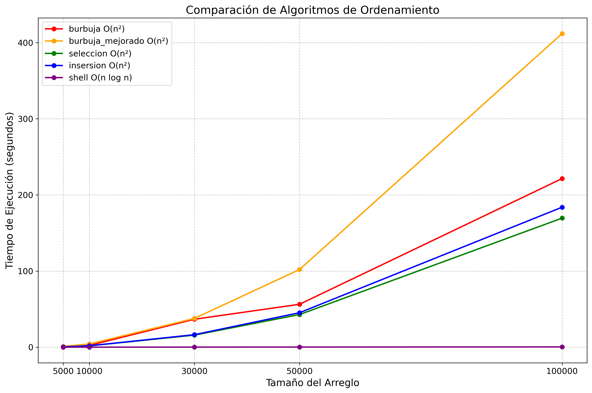

# Benchmark de Algoritmos de Ordenamiento
## 📌 Información General

- **Título:** Proyecto Benchmarking comparacion de metodos de ordenamiento
- **Asignatura:** Estructura de Datos
- **Carrera:** Computación
- **Estudiantes:** Cristian Moscoso - Pablo Feijo
- **Fecha:** 11/05/2025
- **Profesor:** Ing. Pablo Torres

## Descripción

Este proyecto implementa y compara el rendimiento de diferentes algoritmos de ordenamiento en Python. Los algoritmos evaluados incluyen:

- Burbuja (Bubble Sort)
- Burbuja Optimizado (Optimized Bubble Sort)
- Selección (Selection Sort)
- Inserción (Insertion Sort)
- Shell (Shell Sort)

El proyecto mide el tiempo de ejecución de cada algoritmo para diferentes tamaños de arreglos y genera una gráfica comparativa.

## Estructura del Proyecto

- `app.py`: Script principal que ejecuta los benchmarks y genera la gráfica.
- `benchmarking.py`: Clase para medir tiempos de ejecución y generar arreglos aleatorios.
- `sort_methods.py`: Implementación de los algoritmos de ordenamiento.
- `comparacion_algoritmos.png`: Gráfica generada con los resultados.
## Resultados obtenidos:




## Requisitos

- Bibliotecas:
  - matplotlib
  - numpy

Instala las dependencias con:
```bash
pip install matplotlib numpy